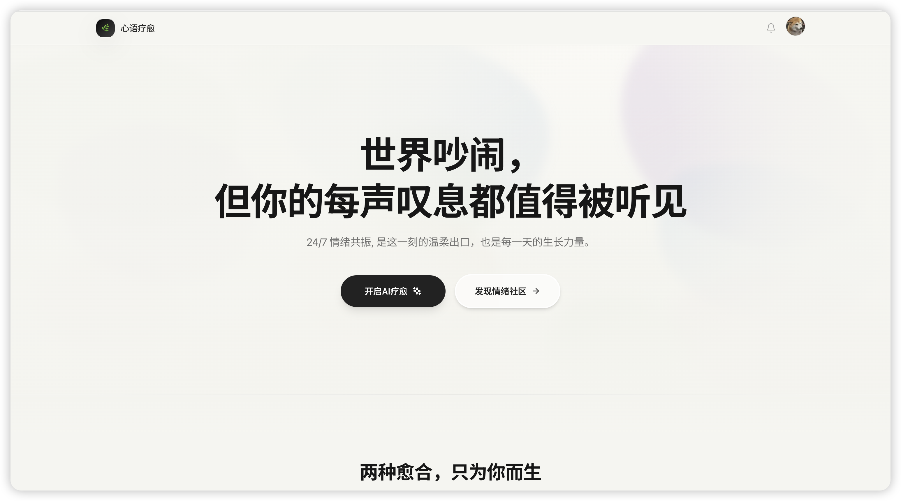
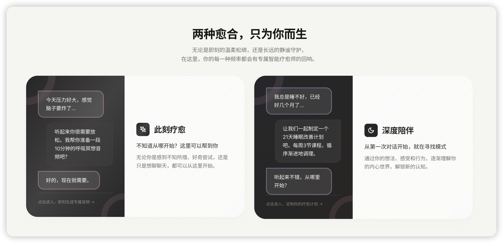
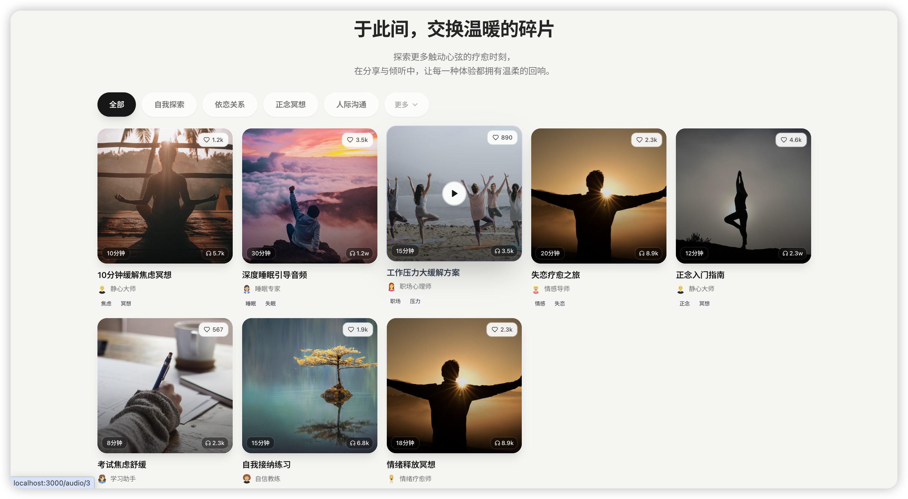

<div align="center">

# 🌸 心语疗愈

**AI 驱动的心理疗愈音频平台**

一个现代化的 Web 应用，通过 AI 对话和音频疗愈，帮助用户获得心灵的平静与成长

[](https://reactjs.org/)
[](https://www.typescriptlang.org/)
[](https://vitejs.dev/)
[](https://expressjs.com/)
[](https://www.mongodb.com/)

[在线演示](#) · [功能特性](#特色功能) · [快速开始](#快速开始) · [API 文档](#api-接口文档)





</div>

---

## ✨ 特色功能

### 🎯 单次疗愈
- **情绪状态识别**：多维度情绪选择（焦虑、压力、悲伤等）
- **场景化定制**：根据工作、学习、睡眠等场景调整
- **强度控制**：1-10 级情绪强度滑块，精准匹配
- **AI 分析生成**：智能生成个性化疗愈音频

### 📋 规划疗愈
- **多轮对话式引导**：通过自然对话深入了解需求
- **阶段性计划**：生成 7-21 天渐进式疗愈方案
- **智能解锁机制**：完成前一阶段 + 到达计划日期才能解锁
- **自动进度追踪**：音频播放完成自动标记完成
- **YouTube 风格界面**：左侧播放器 + 右侧阶段列表

### 🌍 社区分享
- **发布与标签**：12 种预设标签（放松解压、助眠、冥想等）
- **文案编辑**：支持最多 500 字的分享描述
- **标签可视化**：带 emoji 图标的标签展示
- **筛选与搜索**：按标签、分类、排序浏览内容
- **互动功能**：点赞、评论、收藏

### 👤 个人中心
- **账户管理**：头像上传、资料编辑、密码修改
- **作品管理**：查看我的创作、编辑或发布
- **收藏夹**：管理喜欢的音频
- **计划追踪**：查看疗愈计划进度和详情

### 🎨 设计亮点
- **玻璃态设计**：柔和的半透明毛玻璃卡片
- **流动渐变背景**：动态蓝紫粉青四色渐变
- **浮动光晕动画**：背景装饰性动画效果
- **流畅交互动画**：基于 Framer Motion 的过渡动画
- **响应式布局**：完美适配桌面端和移动端

### 🔐 用户引导
- **4 步式问卷**：建立连接 → 生命周期 → 疗愈偏好 → 个人签名
- **个性化推荐**：基于问卷数据定制内容
- **智能守卫**：未完成引导自动跳转

---

## 🛠 技术栈

### 前端技术

<table>
<tr>
<td width="50%">

**核心框架**
- ⚛️ **React 18** - UI 框架，支持并发渲染
- 📘 **TypeScript 5** - 类型安全，提升开发体验
- ⚡ **Vite 5** - 极速的构建工具和开发服务器

**UI & 样式**
- 🎨 **Tailwind CSS 3** - 原子化 CSS 框架
- ✨ **Framer Motion** - 强大的动画库
- 🎯 **Lucide React** - 精美的图标库

</td>
<td width="50%">

**状态与路由**
- 🐻 **Zustand** - 轻量级状态管理 + 持久化
- 🧭 **React Router v6** - 客户端路由
- 🔌 **Axios** - HTTP 请求封装

**工具库**
- 🛠 **clsx + tailwind-merge** - 类名合并
- 📅 **date-fns** - 日期处理

</td>
</tr>
</table>

### 后端技术

<table>
<tr>
<td width="50%">

**核心框架**
- 🚀 **Express 4** - Node.js Web 框架
- 🍃 **MongoDB + Mongoose 8** - NoSQL 数据库
- 📘 **TypeScript** - 类型安全的后端开发

**认证与安全**
- 🔐 **JWT (jsonwebtoken)** - 无状态身份认证
- 🔒 **bcryptjs** - 密码加密
- 🛡️ **Helmet** - 安全头设置
- 🌐 **CORS** - 跨域资源共享

</td>
<td width="50%">

**验证与中间件**
- ✅ **express-validator** - 请求数据校验
- 📝 **Morgan** - HTTP 请求日志
- 🗜️ **Compression** - Gzip 响应压缩
- 📤 **Multer** - 文件上传处理

**开发工具**
- 🔄 **ts-node-dev** - TS 热重载
- 📦 **dotenv** - 环境变量管理

</td>
</tr>
</table>

---

## 📁 项目结构

```
emotion_planner_ai/
├── 📱 src/                          # 前端源码
│   ├── App.tsx                      # 根组件（路由配置）
│   ├── main.tsx                     # 应用入口
│   ├── index.css                    # 全局样式
│   │
│   ├── 🧩 components/               # 可复用组件
│   │   ├── Layout.tsx               # 页面布局容器
│   │   ├── Header.tsx               # 顶部导航栏
│   │   ├── Navigation.tsx           # 底部 Tab 导航
│   │   ├── AuthModal.tsx            # 登录/注册模态框
│   │   ├── AudioCard.tsx            # 音频卡片组件
│   │   ├── PlayerBar.tsx            # 全局播放栏
│   │   ├── FloatingBubbles.tsx      # 背景浮动光晕
│   │   └── AnimatedBackground.tsx   # 渐变背景动画
│   │
│   ├── 📄 pages/                    # 页面组件
│   │   ├── Home.tsx                 # 首页 - 推荐内容
│   │   ├── Onboarding.tsx           # 注册引导问卷（4步）
│   │   ├── Community.tsx            # 社区 - 浏览已发布音频
│   │   ├── Create.tsx               # 创建选择页
│   │   ├── SingleHealing.tsx        # 单次疗愈创建
│   │   ├── PlanHealing.tsx          # 规划疗愈创建
│   │   ├── PlanDetail.tsx           # 疗愈计划详情页
│   │   ├── Profile.tsx              # 个人中心
│   │   ├── Settings.tsx             # 设置页面
│   │   └── AudioPlayer.tsx          # 音频播放页
│   │
│   ├── 🔌 services/                 # API 服务
│   │   └── api.ts                   # Axios 封装
│   │
│   ├── 🗄️ store/                    # Zustand 状态管理
│   │   ├── index.ts                 # 主应用状态
│   │   └── authStore.ts             # 认证状态
│   │
│   ├── 📝 types/                    # TypeScript 类型
│   │   └── index.ts                 # 全局类型定义
│   │
│   └── 🛠️ utils/                    # 工具函数
│       └── index.ts                 # 格式化、生成 ID 等
│
├── 🖥️ server/                       # 后端源码
│   ├── src/
│   │   ├── index.ts                 # Express 应用入口
│   │   │
│   │   ├── 🎮 controllers/          # 业务逻辑控制器
│   │   │   ├── auth.controller.ts   # 认证、注册、引导问卷
│   │   │   ├── user.controller.ts   # 用户资料、关注系统
│   │   │   └── audio.controller.ts  # 音频 CRUD、点赞
│   │   │
│   │   ├── 📊 models/               # Mongoose 数据模型
│   │   │   ├── User.model.ts        # 用户模型
│   │   │   └── Audio.model.ts       # 音频模型
│   │   │
│   │   ├── 🛤️ routes/               # 路由定义
│   │   │   ├── auth.routes.ts
│   │   │   ├── user.routes.ts
│   │   │   └── audio.routes.ts
│   │   │
│   │   ├── 🔐 middleware/           # 中间件
│   │   │   ├── auth.middleware.ts       # JWT 验证
│   │   │   ├── validation.middleware.ts # 数据校验规则
│   │   │   ├── validate.middleware.ts   # 校验执行
│   │   │   ├── upload.middleware.ts     # 文件上传
│   │   │   └── error.middleware.ts      # 错误处理
│   │   │
│   │   └── 🛠 utils/
│   │       └── ApiError.ts          # 自定义错误类
│   │
│   ├── uploads/                     # 上传文件存储
│   │   └── avatars/                 # 用户头像
│   │
│   ├── package.json
│   ├── tsconfig.json
│   └── .env.example                 # 环境变量模板
│
├── public/                          # 静态资源
├── package.json                     # 前端依赖
├── vite.config.ts                   # Vite 配置
├── tailwind.config.js               # Tailwind 配置
├── tsconfig.json                    # TS 配置
└── README.md                        # 项目文档
```

---

## 🚀 快速开始

### 环境要求

确保你的开发环境满足以下条件：

- **Node.js** >= 18.0.0
- **MongoDB** >= 6.0（本地安装或使用 MongoDB Atlas）
- **npm** / **yarn** / **pnpm** 任意包管理器

### 📦 安装步骤

#### 1️⃣ 克隆仓库

```bash
git clone <repository-url>
cd emotion_planner_ai
```

#### 2️⃣ 配置后端

```bash
cd server

# 安装依赖
npm install

# 配置环境变量
cp .env.example .env
```

编辑 `server/.env` 文件：

```env
# 服务配置
PORT=5001
NODE_ENV=development

# 数据库配置
MONGODB_URI=mongodb://localhost:27017/healing_audio_ai
# 或使用 MongoDB Atlas:
# MONGODB_URI=mongodb+srv://<username>:<password>@cluster.mongodb.net/healing_audio_ai

# JWT 配置
JWT_SECRET=your-super-secret-jwt-key-change-this-in-production-2024
JWT_EXPIRES_IN=7d

# 前端地址（CORS 配置）
FRONTEND_URL=http://localhost:3000
```

#### 3️⃣ 启动后端服务

```bash
# 在 server/ 目录下
npm run dev

# 后端将运行在 http://localhost:5001
```

#### 4️⃣ 配置前端

```bash
# 回到项目根目录
cd ..

# 安装依赖
npm install
```

#### 5️⃣ 启动前端服务

```bash
npm run dev

# 前端将运行在 http://localhost:3000
```

### 🎉 访问应用

打开浏览器访问：**http://localhost:3000**

默认情况下：
- 前端运行在 `http://localhost:3000`
- 后端 API 运行在 `http://localhost:5001`

### 🐳 使用 Docker（可选）

```bash
# 构建镜像
docker-compose build

# 启动服务
docker-compose up -d

# 查看日志
docker-compose logs -f

# 停止服务
docker-compose down
```

---

## 📚 API 接口文档

### 基础信息

- **Base URL**: `http://localhost:5001/api`
- **认证方式**: JWT Bearer Token
- **请求头**: 
  ```
  Authorization: Bearer <token>
  Content-Type: application/json
  ```

---

### 🔐 认证接口 (`/api/auth`)

<details>
<summary><b>POST</b> /api/auth/register - 用户注册</summary>

**请求体：**
```json
{
  "username": "testuser",
  "email": "test@example.com",
  "password": "Password123!"
}
```

**响应：**
```json
{
  "success": true,
  "data": {
    "user": {
      "_id": "...",
      "username": "testuser",
      "email": "test@example.com",
      "onboardingCompleted": false
    },
    "token": "eyJhbGciOiJIUzI1NiIsInR5cCI6IkpXVCJ9..."
  }
}
```
</details>

<details>
<summary><b>POST</b> /api/auth/login - 用户登录</summary>

**请求体：**
```json
{
  "email": "test@example.com",
  "password": "Password123!"
}
```

**响应：**
```json
{
  "success": true,
  "data": {
    "user": { /* 用户信息 */ },
    "token": "..."
  }
}
```
</details>

<details>
<summary><b>GET</b> /api/auth/me - 获取当前用户信息 🔒</summary>

**响应：**
```json
{
  "success": true,
  "data": {
    "_id": "...",
    "username": "testuser",
    "email": "test@example.com",
    "nickname": "小明",
    "avatar": "http://...",
    "onboardingCompleted": true,
    "lifeStage": "student",
    "healingPreference": "warm"
  }
}
```
</details>

<details>
<summary><b>POST</b> /api/auth/onboarding - 完成注册引导 🔒</summary>

完成 4 步引导问卷，用于个性化推荐。

**请求体：**
```json
{
  "nickname": "小明",
  "lifeStage": "student",
  "healingPreference": "warm",
  "motto": "每天都是新的开始"
}
```

**字段说明：**

| 字段 | 类型 | 必填 | 可选值 | 说明 |
|------|------|------|--------|------|
| `nickname` | string | ✅ | - | 昵称，最多 20 字符 |
| `lifeStage` | string | ✅ | `student`, `career_start`, `career_mid`, `free_life` | 生命周期阶段 |
| `healingPreference` | string | ✅ | `rational`, `warm` | 疗愈偏好类型 |
| `motto` | string | ❌ | - | 个人签名，最多 100 字符 |

**响应：**
```json
{
  "success": true,
  "data": {
    "user": { /* 更新后的用户信息 */ }
  }
}
```
</details>

<details>
<summary><b>PUT</b> /api/auth/password - 修改密码 🔒</summary>

**请求体：**
```json
{
  "currentPassword": "OldPassword123!",
  "newPassword": "NewPassword123!"
}
```
</details>

---

### 👤 用户接口 (`/api/users`)

<details>
<summary><b>GET</b> /api/users/:id - 获取用户资料</summary>

**响应：**
```json
{
  "success": true,
  "data": {
    "_id": "...",
    "username": "testuser",
    "nickname": "小明",
    "avatar": "http://...",
    "bio": "热爱生活，享受当下",
    "followersCount": 120,
    "followingCount": 45
  }
}
```
</details>

<details>
<summary><b>PUT</b> /api/users/profile - 更新个人资料 🔒</summary>

**请求体：**
```json
{
  "nickname": "新昵称",
  "bio": "个人简介",
  "motto": "座右铭"
}
```
</details>

<details>
<summary><b>POST</b> /api/users/avatar - 上传头像 🔒</summary>

使用 `multipart/form-data` 格式上传。

**参数：**
- **字段名**: `avatar`
- **支持格式**: JPG, PNG, GIF, WebP
- **文件大小**: 最大 5MB
- **访问路径**: `http://localhost:5001/uploads/avatars/{filename}`

**响应：**
```json
{
  "success": true,
  "data": {
    "avatar": "http://localhost:5001/uploads/avatars/avatar-xxx.jpg"
  }
}
```
</details>

<details>
<summary><b>POST</b> /api/users/:id/follow - 关注用户 🔒</summary>

关注指定用户。

**响应：**
```json
{
  "success": true,
  "message": "关注成功"
}
```
</details>

<details>
<summary><b>DELETE</b> /api/users/:id/follow - 取消关注 🔒</summary>

取消关注指定用户。
</details>

<details>
<summary><b>GET</b> /api/users/:id/followers - 获取粉丝列表</summary>

返回用户的粉丝列表。
</details>

<details>
<summary><b>GET</b> /api/users/:id/following - 获取关注列表</summary>

返回用户的关注列表。
</details>

---

### 🎵 音频接口 (`/api/audio`)

<details>
<summary><b>GET</b> /api/audio - 获取音频列表</summary>

支持分页、搜索、分类筛选。

**查询参数：**
- `page`: 页码（默认 1）
- `limit`: 每页数量（默认 20）
- `search`: 搜索关键词
- `category`: 分类筛选
- `sort`: 排序方式（`latest`, `popular`, `hot`）

**响应：**
```json
{
  "success": true,
  "data": {
    "audios": [ /* 音频列表 */ ],
    "pagination": {
      "page": 1,
      "limit": 20,
      "total": 100,
      "pages": 5
    }
  }
}
```
</details>

<details>
<summary><b>GET</b> /api/audio/recommended - 获取推荐音频</summary>

基于用户画像返回个性化推荐。
</details>

<details>
<summary><b>GET</b> /api/audio/:id - 获取音频详情</summary>

**响应：**
```json
{
  "success": true,
  "data": {
    "_id": "...",
    "title": "深度放松冥想",
    "description": "适合睡前聆听的冥想音频",
    "audioUrl": "http://...",
    "coverImage": "http://...",
    "duration": 600,
    "category": "meditation",
    "tags": ["relax", "sleep", "meditation"],
    "creator": { /* 创作者信息 */ },
    "likes": 1234,
    "listens": 5678
  }
}
```
</details>

<details>
<summary><b>POST</b> /api/audio - 创建音频 🔒</summary>

**请求体：**
```json
{
  "title": "深度放松冥想",
  "description": "适合睡前聆听的冥想音频",
  "audioUrl": "http://...",
  "coverImage": "http://...",
  "duration": 600,
  "category": "meditation",
  "tags": ["relax", "sleep"],
  "isPublic": false
}
```
</details>

<details>
<summary><b>PUT</b> /api/audio/:id - 更新音频 🔒</summary>

只能更新自己创建的音频。

**请求体：**
```json
{
  "title": "更新后的标题",
  "description": "更新后的描述",
  "tags": ["relax", "meditation"],
  "isPublic": true
}
```
</details>

<details>
<summary><b>DELETE</b> /api/audio/:id - 删除音频 🔒</summary>

只能删除自己创建的音频。
</details>

<details>
<summary><b>POST</b> /api/audio/:id/like - 点赞/取消点赞 🔒</summary>

切换点赞状态。

**响应：**
```json
{
  "success": true,
  "data": {
    "liked": true,
    "likesCount": 1235
  }
}
```
</details>

---

### 📡 错误响应格式

所有错误响应遵循统一格式：

```json
{
  "success": false,
  "error": {
    "message": "错误描述",
    "statusCode": 400
  }
}
```

**常见状态码：**
- `400` - 请求参数错误
- `401` - 未认证或 Token 失效
- `403` - 无权限访问
- `404` - 资源不存在
- `500` - 服务器内部错误

---

## 🎯 核心功能详解

### 📝 注册引导（Onboarding）

新用户注册后会进入 4 步对话式引导问卷，用于建立个性化档案：

#### **第 1 步：建立连接**
- 输入昵称，建立亲密感
- 支持中文、英文、emoji

#### **第 2 步：生命周期阶段**
- 🎓 **求学探索期** - 在校学生，探索人生方向
- 💼 **职场适应期** - 初入职场，面临新挑战
- 📊 **中坚奋斗期** - 职场中期，承担重要责任
- 🌅 **自由慢生活** - 追求生活品质与平衡

#### **第 3 步：疗愈偏好**
- 🧠 **理智重构型** - 逻辑分析，认知调整
- ❤️ **温暖抱持型** - 情感共鸣，心灵陪伴

#### **第 4 步：个人签名**
- 可选填写座右铭或人生格言
- 最多 100 个字符

问卷数据用于：
- ✅ 个性化音频推荐
- ✅ AI 疗愈内容定制
- ✅ 社区内容匹配

---

### 🎨 单次疗愈流程

1. **选择情绪状态**（可多选）
   - 😰 焦虑 / 😔 悲伤 / 😤 愤怒 / 😓 压力
   - 😟 迷茫 / 😞 孤独 / 😨 恐惧 / 🥱 疲惫

2. **选择使用场景**（可多选）
   - 💼 工作 / 📚 学习 / 🏠 生活
   - 💑 情感 / 😴 睡眠 / 🧘 放松

3. **调节情绪强度**
   - 滑块调节 1-10 级
   - 实时显示情绪标签（轻微/中等/强烈等）

4. **AI 分析生成**
   - 情绪分析
   - 场景适配
   - 个性化音频生成

---

### 📅 规划疗愈流程

1. **预填基础信息**
   - 情绪状态 + 强度
   - 场景 + 持续时长
   - 身体感受 + 疗愈目标

2. **多轮对话深入了解**
   - AI 自然对话引导
   - 深入挖掘需求
   - 3-5 轮对话
   - 快捷回复支持

3. **生成阶段性计划**
   - 7-21 天渐进式方案
   - 每个阶段包含：
     - 标题 + 描述
     - 音频时长
     - 疗愈技巧标签
     - 计划日期

4. **执行与追踪**
   - YouTube 风格界面
   - 左侧：音频播放器
   - 右侧：阶段列表
   - 智能解锁机制
   - 自动进度追踪

---

### 🌍 社区功能

#### **浏览与发现**
- 网格/列表布局切换
- 12 种标签筛选
- 关键词搜索
- 排序（最新/最热/最受欢迎）

#### **发布音频**
1. 点击音频播放页的分享图标
2. 选择标签（可多选，至少 1 个）
3. 填写分享文案（可选，最多 500 字）
4. 确认发布

#### **标签系统**
带 emoji 的可视化标签：
- 🌊 放松解压 / 🌙 助眠 / 🧘 冥想
- 💆 焦虑缓解 / 💖 情绪疗愈 / 🎯 专注力
- ☀️ 正念练习 / 🌬️ 呼吸引导 / ✨ 身体扫描
- 🌸 自我关怀 / ⚡ 能量提升 / 🌈 创伤疗愈

#### **互动功能**
- ❤️ 点赞
- 💬 评论（支持二次点赞）
- ⭐ 收藏
- 📤 分享

---

### 👤 个人中心

#### **账户管理**
- 头像上传（支持裁剪）
- 资料编辑（昵称、简介、签名）
- 密码修改
- 隐私设置

#### **内容管理**
- **我的作品** - 查看、编辑、发布/取消发布
- **我的收藏** - 快速访问喜欢的音频
- **疗愈计划** - 查看计划进度和详情

#### **社交统计**
- 关注数 / 粉丝数
- 获赞数 / 播放量

---

## 🗺️ 前端路由

| 路径 | 组件 | 说明 | 守卫 |
|------|------|------|------|
| `/` | Home | 首页 - 推荐内容 | - |
| `/onboarding` | Onboarding | 注册引导问卷 | 需登录 |
| `/community` | Community | 社区 - 浏览已发布音频 | - |
| `/create` | Create | 创建选择页 | 需登录 |
| `/create/single` | SingleHealing | 单次疗愈创建 | 需登录 |
| `/create/plan` | PlanHealing | 规划疗愈创建 | 需登录 |
| `/plan/:id` | PlanDetail | 疗愈计划详情 | 需登录 |
| `/audio/:id` | AudioPlayer | 音频播放页 | - |
| `/profile` | Profile | 个人中心 | 需登录 |
| `/settings` | Settings | 设置页面 | 需登录 |

**路由守卫：**
- 未登录访问需登录的页面 → 显示登录模态框
- 已登录但未完成引导 → 自动跳转到 `/onboarding`

---

## 📊 数据模型

### User（用户模型）

```typescript
{
  _id: ObjectId;                    // MongoDB ID
  username: string;                 // 用户名（唯一，3-20 字符）
  email: string;                    // 邮箱（唯一）
  password: string;                 // 密码（bcrypt 加密，查询时不返回）
  avatar: string;                   // 头像 URL
  bio: string;                      // 个人简介（最多 200 字）
  
  // 引导问卷数据
  nickname: string;                 // 昵称（最多 20 字）
  lifeStage: enum;                  // 生命周期阶段
                                    // student | career_start | career_mid | free_life
  healingPreference: enum;          // 疗愈偏好
                                    // rational（理智重构）| warm（温暖抱持）
  motto: string;                    // 个人签名（最多 100 字）
  onboardingCompleted: boolean;     // 是否完成引导
  
  // 社交数据
  favoriteAudios: ObjectId[];       // 收藏的音频 ID 列表
  createdAudios: ObjectId[];        // 创建的音频 ID 列表
  followers: ObjectId[];            // 粉丝 ID 列表
  following: ObjectId[];            // 关注的用户 ID 列表
  
  // 时间戳
  createdAt: Date;                  // 创建时间
  updatedAt: Date;                  // 更新时间
}
```

### Audio（音频模型）

```typescript
{
  _id: ObjectId;                    // MongoDB ID
  title: string;                    // 标题（必填，最多 100 字）
  description: string;              // 描述（最多 1000 字）
  audioUrl: string;                 // 音频文件 URL
  coverImage: string;               // 封面图片 URL
  duration: number;                 // 音频时长（秒）
  
  // 分类与标签
  category: enum;                   // 分类
                                    // meditation | sleep | focus | relax | nature | music | other
  tags: string[];                   // 标签列表（最多 10 个）
                                    // relax, sleep, meditation, anxiety, emotion, focus, etc.
  
  // 作者与权限
  creator: ObjectId;                // 创作者 ID（引用 User）
  isPublic: boolean;                // 是否公开（true=发布到社区）
  
  // 统计数据
  likes: ObjectId[];                // 点赞用户 ID 列表
  listens: number;                  // 播放次数
  
  // 时间戳
  createdAt: Date;                  // 创建时间
  updatedAt: Date;                  // 更新时间
}
```

**索引设置：**
- User: `username` (unique), `email` (unique)
- Audio: `creator`, `category`, `isPublic`, `createdAt`

---

## 🛠 开发命令

### 前端

```bash
# 安装依赖
npm install

# 启动开发服务器（http://localhost:3000）
npm run dev

# 类型检查
npm run type-check

# 代码检查
npm run lint

# 构建生产版本
npm run build

# 预览生产构建
npm run preview
```

### 后端

```bash
cd server

# 安装依赖
npm install

# 启动开发服务器（http://localhost:5001，支持热重载）
npm run dev

# 类型检查
npm run type-check

# 编译 TypeScript
npm run build

# 运行编译后的代码
npm start
```

### 常用脚本

```bash
# 同时启动前后端（需要安装 concurrently）
npm run dev:all

# 清理构建产物
npm run clean

# 运行测试
npm test

# 数据库迁移
npm run migrate
```

---

## 🎨 设计系统

### 颜色方案

```css
/* 主色调 */
--primary: #8B5CF6;        /* 紫色 */
--secondary: #06B6D4;      /* 青色 */

/* 中性色 */
--neutral-50: #FAFAFA;
--neutral-100: #F5F5F5;
--neutral-200: #E5E5E5;
--neutral-400: #A3A3A3;
--neutral-600: #525252;
--neutral-800: #262626;
--neutral-900: #171717;

/* 功能色 */
--rose-500: #F43F5E;       /* 点赞、错误 */
--sky-500: #0EA5E9;        /* 链接、信息 */
--emerald-500: #10B981;    /* 成功 */
--amber-500: #F59E0B;      /* 警告 */
```

### 组件样式类

```css
.glass          /* 玻璃态效果 */
.card           /* 卡片容器 */
.btn-primary    /* 主要按钮 */
.btn-secondary  /* 次要按钮 */
.input-clean    /* 输入框样式 */
.text-gradient  /* 渐变文字 */
```

### 动画

- **页面切换**: Fade + Slide（200-400ms）
- **卡片悬停**: Scale 1.02 + Shadow
- **按钮点击**: Scale 0.98
- **加载状态**: Spinner + Pulse

---

## 📱 响应式断点

```javascript
// Tailwind CSS 默认断点
sm: '640px'   // 小屏设备
md: '768px'   // 平板
lg: '1024px'  // 小型桌面
xl: '1280px'  // 大型桌面
2xl: '1536px' // 超大屏
```

---

## 🔧 配置文件说明

### `vite.config.ts`
```typescript
export default defineConfig({
  plugins: [react()],
  server: {
    port: 3000,
    proxy: {
      '/api': 'http://localhost:5001'
    }
  },
  resolve: {
    alias: {
      '@': path.resolve(__dirname, './src')
    }
  }
});
```

### `tailwind.config.js`
```javascript
module.exports = {
  content: ['./index.html', './src/**/*.{js,ts,jsx,tsx}'],
  theme: {
    extend: {
      colors: {
        primary: {...},
        neutral: {...}
      },
      animation: {
        'float': 'float 3s ease-in-out infinite'
      }
    }
  }
};
```

---